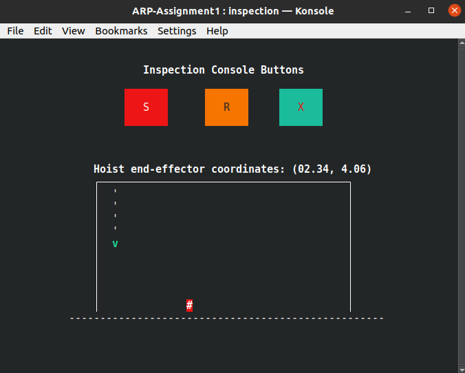

# ARP-Hoist-Assignment
Base project structure for the first *Advanced and Robot Programming* (ARP) assignment.
The project provides the basic functionalities for the **Command** and **Inspection processes**, both of which are implemented through the *ncurses library* as simple GUIs. In particular, the repository is organized as follows:
- The `src` folder contains the source code for the Command, Inspection and Master processes.
- The `include` folder contains all the data structures and methods used within the ncurses framework to build the two GUIs. Unless you want to expand the graphical capabilities of the UIs (which requires understanding how ncurses works), you can ignore the content of this folder, as it already provides you with all the necessary functionalities.
- The `bin` folder is where the executable files are expected to be after compilation.

## ncurses installation
To install the ncurses library, simply open a terminal and type the following command:
```console
sudo apt-get install libncurses-dev
```

## Compiling and running the code
The Command and Inspection processes depend on the ncurses library, which needs to be linked during the compilation step. Furthermore, the Inspection process also uses the mathematical library for some additional computation. Therefore the steps to compile are the following:
1. For the **Inspection process**:
	```console
	gcc src/inspection_console.c -lncurses -lm -o bin/inspection
	```
2. For the **Command process**:
	```console
	gcc src/command_console.c -lncurses -o bin/command
	```
3. Other processes:
	```console
	gcc src/*.c -o bin/*
	```
	
We also provide the shell script `compile.sh` which compiles all processes to the `./bin/` folder. It can be run by writing:
```console
./compile.sh
```

After compiling, **assuming you have Konsole installed in your system** as per the professor's indications, you can **simply run the Master executable**, which will be responsible of spawning all other processes:
```console
./bin/master
```

## Troubleshooting

Should you experience some weird behavior after launching the application (buttons not spawning inside the GUI or graphical assets misaligned) simply try to resize the terminal window, it should solve the bug.

In case of any problems which may occur the first time running the master process, closing the consoles and terminating the process, and rerunning `./bin/master` will most likely solve the issues (sometimes need to rerun it twice).

## A note about the consoles:

The two consoles: Inspection and Command console will be controlling the movement of the hoist, as instructed. All the process logs, user inputs, etc., are written to the log files inside `logs/`. 

Apart from the already present **Stop** `S` and **Reset** `R` buttons, we have implemented an extra **exit** button `X`, which can be used to terminate all the processes and close the consoles.




## Branch Info:

- **main**: In this version, the `master` process also performs `watchdog` duties. Watchdog uses the log files information (mtime) to keep track of the inactivity of the processes
- **exp**: Experimental branch, where changes are made before merging to other branches. Right now it should be the same as **version2**.
- **version2**: In this version, `master` only spawns the processes and the watchdog is a separate process. The watchdog receives periodically "alive" messages from other processes and keeps track of their inactivity using the lack of such messages. 


## Programming Paradigms

- All Inter Process Communications are done using named pipes (FIFOs).
- Most processes also use the `select` function to monitor `pipes` and read only when data is avaialable in them.
- We use the `sigaction` POSIX function to perform all signal handling for all the pre-existing and user defined signals.


## Brief Explanations about the processes

- Master: 
	- Spawns the `command` console.
	- Spawns the motor processes `motorx` and `motorz`.
	- Spawns the `world` process.
	- Spawns the `inspection` console, which takes the pid's of the motor processes.
	- Performs `watchdog` duties: keeps track of inactivity time for every process looking at the `mtime` property of all log files.
	- Waits for the termination of the 'konsoles' and terminates the programs.

- Command Console:
	- Sends the user input for controlling motors to both motors, `motorx` and `motorz`.
	- Logs the status messages (user inputs) and any errors in the log file.

- Inspection Console:
	- Keeps track of the 3 buttons, `Stop`, `Reset` and `X` (EXIT) buttons.
	- Sends the coresponding signal to both motors and cmd.
	- Logs the button pressed (user input) and any errors in the log file.

- MotorX and MotorZ:
	- Set (or Resets) the desired velocities of the hoist (increasing or decreasing by a set buffer) received from `cmd` pipe.
	- Send the desired `x` and `z` positions to the world process using fifos.
	- logs the desired position and any errors in the log file.

- World:
	- Receives the `x` and `z` position of the hoist (from the motors)
	- Generates (simulates) a random error within a defined range (5%).
	- Sends generated positions to the inspection console.
	- Logs the received position and the generated one, as well as any errors, in the log file.


## Known Issues:

- After pressing the exit button (in the inspection console) "broken pipe" errors are produced in `motorx`, `motorz` and `world` which are actually recorded in their corresponding log files. This is most likely caused due to the long time between the termination of the consoles and these other processes, giving them enough time to try to read from closed pipes. This error is not present when processes are terminated due to inactivity for instance. These errors are handled through the handling of the SIGPIPE signal produced.
