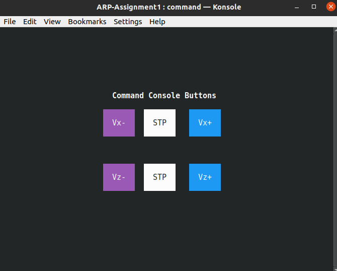

# ARP-Hoist-Assignment
Base project structure for the first *Advanced and Robot Programming* (ARP) assignment.
The project provides the basic functionalities for the **Command** and **Inspection processes**, both of which are implemented through the *ncurses library* as simple GUIs. In particular, the repository is organized as follows:
- The `src` folder contains the source code for the Command, Inspection and Master processes.
- The `include` folder contains all the data structures and methods used within the ncurses framework to build the two GUIs. Unless you want to expand the graphical capabilities of the UIs (which requires understanding how ncurses works), you can ignore the content of this folder, as it already provides you with all the necessary functionalities.
- The `bin` folder is where the executable files are expected to be after compilation.

## ncurses installation
To install the ncurses library, simply open a terminal and type the following command:
```console
sudo apt-get install libncurses-dev
```

## Compiling and running the code
The Command and Inspection processes depend on the ncurses library, which needs to be linked during the compilation step. Furthermore, the Inspection process also uses the mathematical library for some additional computation. Therefore the steps to compile are the following:
1. for the **Inspection process**:
	```console
	gcc src/inspection_console.c -lncurses -lm -o bin/inspection
	```
2. for the **Command process**:
	```console
	gcc src/command_console.c -lncurses -o bin/command
	```
3. for the **Master process**:
	```console
	gcc src/master.c -o bin/master
	```

After compiling, **assuming you have Konsole installed in your system** as per the professor's indications, you can **simply run the Master executable**, which will be responsible of spawning the two GUIs:
```console
./bin/master
```

## Troubleshooting

Should you experience some weird behavior after launching the application (buttons not spawning inside the GUI or graphical assets misaligned) simply try to resize the terminal window, it should solve the bug.

In case of any problems which may occur the first time running the master process, closing the consoles and terminating the process, and rerunning `./bin/master` will solve the issues.

## A note about the consoles:

The two consoles: Inspection and Command console will be controlling the movement of the hoist, as instructed. All the process logs, user inputs, etc., are written to the log files inside `logs/`. 

Apart from the already present **Stop** `S` and **Reset** `R` buttons, we have implemented an extra **exit** button `X`, which can be used to terminate all the processes and close the consoles.




## Branch Info:

- **main**: The main code presented as assignment. Either one of the two working implementations present in the branches `exp` and `version2` could be chosen. Currently, we decided to merge branch `?` into main.
- **exp**: In this version, the `watchdog` process is responsible for writing the status messages as well as stringent logging.
- **version2**: In this version, the `master` process also performs `watchdog` duties.


## Programming Paradigms

- All Inter Process Communications are done using named pipes (FIFOs).
- Most processes also use `select` function to monitor `pipes` and read only when data is avaialable in them.
- We use `sigaction` POSIX function to perform all signal handling for all the pre-existing or user defined signals.


## Brief Explanations about the processes

- Master: 
	- Spawns the motor processes `motorx` and `motorz`
	- Spawns the `inspection` console, which takes the pid's of the motor processes
	- Spawns the `command` console
	- Spawns the `world` process
	- Performs `watchdog` duties
	- Waits for the termination of the 'konsoles' and terminates the programs

- Command Console:
	- Sends the user input for controlling motors to both motors, `motorx` and `motorz`.
	- Logs the status messages (user inputs) and and any errors in the log file

- Inspection Console:
	- _

- MotorX:
	- _

- MotorZ:
	- _

- World:
	- _


## Known Issues:

- Upon pressing the Reset button on the inspection console, the command console was no longer accepting the commands to increase or decrease the velocity of the hoist. Moreover, the errors or status messages corresponding to `motorx`, `motory` and `world` were no longer getting logged. The issue was that the named pipe is broken / shut down upon doing so (no longer connected), and has to be handled and logged explicitly using `sigaction`.